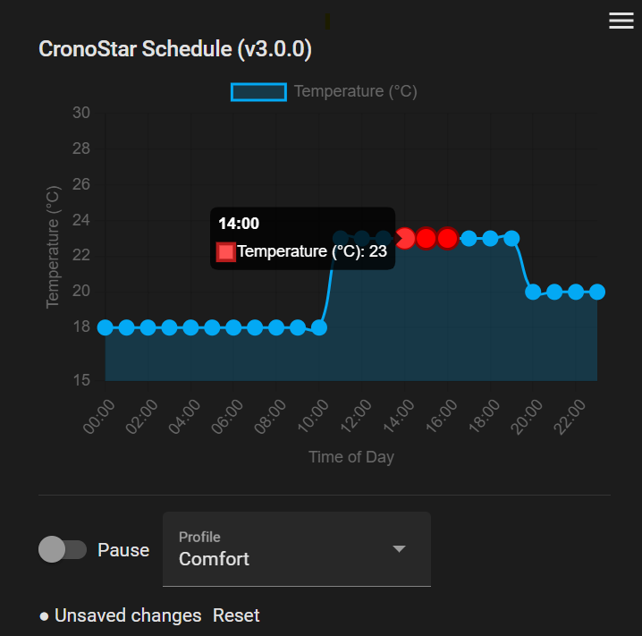

# CronoStar

[](https://github.com/hacs/integration)
[](https://github.com/FoliniC/cronostar-card/releases)
[](LICENSE)

A powerful and intuitive Lovelace card for managing hourly schedules in Home Assistant with a visual editor, now named CronoStar.



## ✨ Features

- ✅ **Generic Scheduler** - Configure for any hourly value: temperature, power, etc.
- 📊 **Visual Schedule Editor** - Interactive Chart.js graph with drag-and-drop control.
- 🎯 **Multi-Point Selection** - Select and modify multiple hours simultaneously (Shift + drag).
- ⌨️ **Advanced Keyboard Controls** - Precise adjustments with arrow keys, plus Ctrl+A for select all.
- ⚙️ **Settings Menu** - Access additional options like language selection and help.
- 🌐 **Internationalization** - Support for multiple languages (English and Italian).
- 💾 **Profile Management** - Save and load multiple schedule profiles.
- 🔄 **Auto-Save** - Automatically saves changes when switching profiles.
- 📱 **Responsive Design** - Works on desktop, tablet, and mobile.
- 🎨 **Theme Integration** - Respects Home Assistant themes.

## 🚀 Quick Start

### 💡 Simple Usage

**Italiano:**
> Aggiungi il componente, configura le entità dei valori per ogni ora (le trovi già pronte nel log del browser F12) e usale nella tua automazione. Fine!

**English:**
> Add the component, configure the value entities for each hour (you can find them ready in the browser log F12) and use them in your automation. Done!

### Installation

Installation is best done via HACS. If you do not have HACS, please install it first.

1.  Open HACS in Home Assistant.
2.  Go to "Frontend" -> Click the "+" button.
3.  Search for "CronoStar Card" and install it.
4.  Restart Home Assistant.

### Manual Installation

1.  Download `cronostar-card.js` from the [latest release](https://github.com/FoliniC/cronostar-card/releases).
2.  Copy it to your `/config/www/` directory.
3.  Add it as a resource in Lovelace:
    ```yaml
    resources:
      - url: /local/cronostar-card.js
        type: module
    ```

## 📖 Configuration

The card now includes presets to simplify configuration for common use cases. You can select a preset and override any specific option.

### Using Presets

The `preset` option allows you to quickly configure the card. Available presets are `thermostat` (default) and `ev_charging`.

**Example: Thermostat (Default Preset)**

This is the simplest configuration. It uses the `thermostat` preset by default.

```yaml
type: custom:cronostar-card
entity_prefix: temperature_hour_ # Make sure this matches your input_numbers
```

**Example: EV Charging**

To configure the card for EV charging, set the `preset` to `ev_charging`. You can then override any setting from the preset, like the `title`.

```yaml
type: custom:cronostar-card
preset: ev_charging
title: My EV Charging Schedule
entity_prefix: ev_charge_hour_ # Make sure this matches your input_numbers
```

### Custom Configuration

You can also define everything manually without using a preset by setting the options yourself.

```yaml
type: custom:cronostar-card
title: Custom Scheduler
entity_prefix: my_custom_hour_
y_axis_label: "My Value"
unit_of_measurement: "%"
min_value: 0
max_value: 100
step_value: 5
```

## 📊 Options Reference

| Option | Type | Default | Description |
|--------|------|---------|-------------|
| `type` | string | **required** | `custom:cronostar-card` |
| `preset` | string | `thermostat` | Use a pre-defined configuration (`thermostat` or `ev_charging`). Options can be overridden. Can also be changed from the card's menu. |
| `entity_prefix` | string | **required** | Prefix for your 24 hourly `input_number` entities. |
| `title` | string | (from preset) | The card title. |
| `y_axis_label` | string | (from preset) | Custom label for the Y-axis. |
| `unit_of_measurement` | string | (from preset) | Unit of measurement to display. |
| `min_value` | number | (from preset) | Minimum value for the Y-axis. |
| `max_value` | number | (from preset) | Maximum value for the Y-axis. |
| `step_value` | number | (from preset) | Step for value adjustments. |
| `pause_entity` | string | - | `input_boolean` entity to pause/resume the schedule. |
| `profiles_select_entity` | string | - | `input_select` entity for profile selection. |
| `save_script` | string | `script.save_temperature_profile` | Script to save profiles. |
| `load_script` | string | `script.load_temperature_profile` | Script to load profiles. |
| `hour_base` | number/string | `auto` | Hour numbering: `0` (00-23) or `1` (01-24). |
| `logging_enabled` | boolean | `false` | Enable/disable detailed logging in the browser console. Can also be toggled from the card's menu. |
| `chartjs_path` | string | `/local/chart.min.js` | Path to Chart.js library. |
| `dragdata_path` | string | `/local/chartjs-plugin-dragdata.min.js` | Path to the Chart.js drag data plugin. |


## 📝 Changelog

See [changelog.md](changelog.md) for version history.

## v2.3.0 (Latest)
- ✅ Improved: Project renamed to CronoStar. The name 'Crono' highlights its scheduling nature, making it clear it's designed for time-based controls, such as thermostats and other daily routines.

### v2.22.11 
- ✅ Fixed: Logging visibility issue resolved; `Logger.warn` now respects `logging_enabled` setting.
- ✅ Fixed: Interface no longer unresponsive when 'Anomalous operation' message is displayed (pointer events are now ignored by the overlay).
- ✅ Improved: Missing entities warning is now logged only once per change in missing entities list.
- ✅ Improved: Watermark styling further refined to be less intrusive.
- ✅ Version patch incremented.

### v2.22.9
- ✅ Fixed: Logging visibility issue resolved by replacing direct `console.log` calls with `Logger.log`.
- ✅ Improved: Watermark styling refined to be less intrusive (transparent background, lighter color, dynamic text).
- ✅ Improved: Default configuration now uses a `generic_kwh` preset (0-7 kWh) if no preset is specified.
- ✅ Version patch incremented.

### v2.22.8
- ✅ Fixed: `TIMEOUTS` ReferenceError resolved by importing `TIMEOUTS` in `cronostar-card.js`.
- ✅ Improved: Watermark styling refined to be less intrusive (lighter color, no background).
- ✅ Improved: Missing entities are now logged as a single, grouped message in the console.
- ✅ Version patch incremented.

### v2.22.7
- ✅ Fixed: When `input_number` entities are missing, the card now uses default values and displays a clear warning message and a watermark on the chart.
- ✅ Version patch incremented.

### v2.22.6
- ✅ Fixed: When loading presets with missing `input_number` entities, a clear message is now displayed listing the required entities.
- ✅ Version patch incremented.

### v2.22.5
- ✅ Fixed: Logging is now correctly disabled at startup when `logging_enabled` is `false`.
- ✅ Version patch incremented.

### v2.22.4
- ✅ Fixed: Logging toggle and preset selection now work correctly and close the menu.
- ✅ Improved: Added warning logs when `input_number` entities are not found for a preset.
- ✅ Version patch incremented.

### v2.22.3
- ✅ Fixed: Logging toggle and preset selection now work correctly and close the menu.
- ✅ Version patch incremented.

### v2.22.2
- ✅ Added UI controls in the card's menu for `logging_enabled` and `preset` selection.
- ✅ Fixed: Menu now closes after selecting logging or preset options.
- ✅ Version patch incremented.

### v2.22.0
- ✅ Added `preset` option for quick configuration (`thermostat`, `ev_charging`).
- ✅ Added `logging_enabled` option to control console output.
- ✅ Versioning scheme updated to increment minor version for new features.

### v2.21.0
- ✅ Made the card generic for any scheduled value (e.g., EV charging power).
- ✅ Added `y_axis_label`, `unit_of_measurement`, `min_value`, `max_value`, and `step_value` options.
- ✅ Updated documentation with new options and examples.

### v2.20.0
- ✅ Added settings menu with language selection (EN/IT) and help.
- ✅ Added Ctrl+A shortcut to select all points.
- ✅ Changed arrow key behavior to align with leftmost/rightmost selected point.
- ✅ Upgraded to Lit 3.
- ✅ Fixed several bugs related to localization and component initialization.

## 🤝 Contributing

Contributions are welcome! Please read [CONTRIBUTING.md](CONTRIBUTING.md) for details.

## 📄 License

MIT License - see [LICENSE](LICENSE) file for details.

## 💬 Support

- 🐛 [Report a Bug](https://github.com/FoliniC/cronostar-card/issues)
- 💡 [Request a Feature](https://github.com/FoliniC/cronostar-card/issues)
- 💬 [Community Forum](https://community.home-assistant.io/)

## 🙏 Credits

- Built with [Lit](https://lit.dev/)
- Charting by [Chart.js](https://www.chartjs.org/)
- Drag functionality by [chartjs-plugin-dragdata](https://github.com/chrispahm/chartjs-plugin-dragdata)

---

**Made with ❤️ for Home Assistant**
